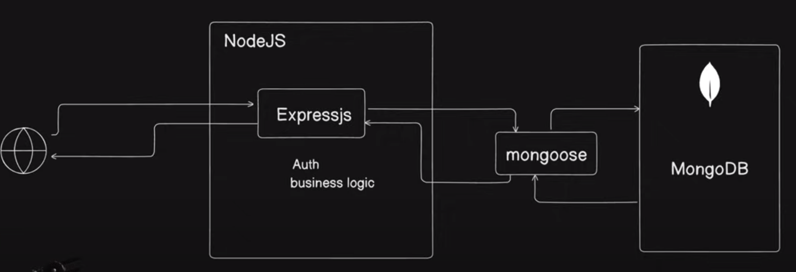

# Express :

- Express.js is a minimal and flexible Node.js web application framework that provides a robust set of features for building web and mobile applications.
- It is designed to make developing web applications and APIs with Node.js simpler and more efficient.
- Business logic and Auth logic is implemented in JS via Express library
- Alternatives : Hono , Elysia.Js

## Key Features of Express.js

1. Middleware:
   - Express.js uses a series of middleware functions to handle requests and responses.
   - Middleware can perform tasks like parsing request bodies, handling cookies, and more.
2. Routing:
   - Provides a powerful and intuitive routing mechanism, allowing developers to define routes for handling different HTTP methods and URLs.
3. Templating:
   - Supports various templating engines such as Pug (formerly Jade), EJS, and Handlebars, enabling dynamic content generation.
4. Extensible:
   - Highly extensible via a rich ecosystem of plugins and third-party modules.
5. HTTP Utilities:
   - Simplifies handling of HTTP requests and responses, including features for content negotiation, redirection, caching, and more.

## How to create a Express server

- Express.js simplifies the process of writing server-side code by abstracting the boilerplate code required for handling HTTP requests and responses.
- It allows developers to focus on the core logic of their applications.

### Step-by-Step Guide

1. Install Node.js and npm: Ensure Node.js and npm are installed.
2. Create a New Project: Initialize a new Node.js project.
   > npm init - y
3. Install Express.js: Use npm to install Express.js.
   > npm install express
4. Create a Server: Write a basic Express.js server to handle HTTP requests and responses.
   > refer to index.js file
5. Run the server :
   > node index.js

## Express workflow

```
Client                       Express.js Server
  ↓                               |
  |     HTTP Request (GET /)      |
  ↳------------------------------>|
  |                               |
  |   1. Middleware (if any)      |
  |                               |
  |   2. Route Handler (/ route)  ↓
  ↑   app.get('/', (req, res)     |
  |      => { res.send('Hello,    |
  |          World!'); });        |
  |                               |
  |  HTTP Response (Hello, World!)|
  |                               |
  |<------------------------------↲
  |                               |

```

## Advantages of Using Express.js

1. Simplicity and Minimalism: Provides just the essential features needed for web development, without unnecessary complexity.
2. Flexibility: Can be extended with a variety of middleware and plugins to add functionality.
3. Performance: Lightweight and fast, leveraging Node.js’s event-driven architecture.
4. Community and Ecosystem: A large and active community, with many plugins and modules available via npm.

---

---

# MongoDB

- MongoDB is a popular, open-source, NoSQL database management system.
- Unlike traditional relational databases that use tables and rows, MongoDB uses a flexible, document-oriented data model, allowing it to store and manage data in a more dynamic way.

## Core Components

- Database: A container for collections.
- Collection: A grouping of MongoDB documents, equivalent to a table in relational databases.
- Document: The basic unit of data in MongoDB, equivalent to a row in relational databases, but more flexible as it can have varying structures.
- Field: A key-value pair in a document, similar to a column in relational databases.

## how data is stored in a MongoDB document

```
{
  "_id": "507f1f77bcf86cd799439011",
  "name": "John Doe",
  "age": 29,
  "address": {
    "street": "123 Main St",
    "city": "Anytown",
    "state": "CA",
    "zip": "12345"
  },
  "hobbies": ["reading", "gaming", "hiking"]
}

```

# Mongoose :

- Mongoose is an Object Data Modeling (ODM) library for MongoDB and Node.js.
- It provides a straightforward, schema-based solution to model application data, making it easier to work with MongoDB.
- Mongoose includes built-in type casting, validation, query building, business logic hooks, and more.
- Alteranatives : Prisma , Drizzle

## Workflow

1. Define Schema
2. Create Model from Schema
3. Perform CRUD Operations using Model
4. Mongoose interacts with MongoDB

```
+-----------------+
| MongoDB Database|
+-----------------+
        ^
        |
+-----------------+
| Mongoose        |
+-----------------+
        ^
        |
+-----------------+
| Application Code|
+-----------------+

```

---

---

# Dependencies Vs DevDependencies

```
| Aspect                 |            Dependencies             |                              DevDependencies |
| ---------------------- | :---------------------------------: | -------------------------------------------: |
| Usage                  | Required for the application to run | Required only during development and testing |
| Installation Command   |    npm install `<package-name>`     |              npm install -D `<package-name>` |
| Example Packages       |      express, mongoose, lodash      |                        eslint, jest, webpack |
| Included in Production |                 Yes                 |                                           No |
| package.json Section   |            dependencies             |                              devDependencies |
```

- nodemon - restarts the server every time a new change is made to the project, as a result the content of the project is refreshed.

# commands

> npm init -> Initialize a node project -> creates a package.json file.

> npm install express -> installs express in our project as dependency

> npm install -D nodemon -> installs nodemon in our project as devDependency

> node index.js -> executes the index.js file.
